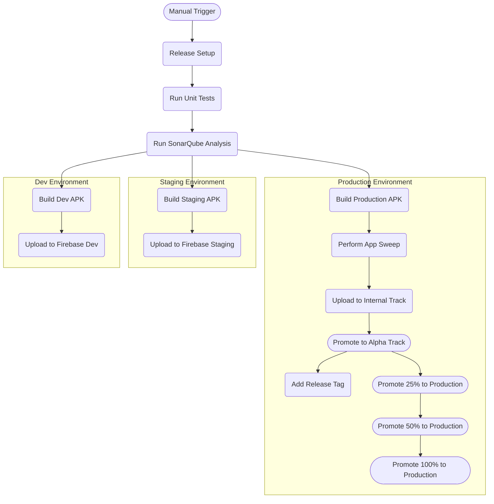

# **CI/CD Implementation**

## **CI Workflow**

The CI Workflow is responsible for ensuring the quality of code changes before they are merged into the main branch. It performs the following tasks:

1.  **Unit Testing:** Executes unit tests for all modules to ensure new code does not break existing functionality. This helps identify and fix bugs early in the development process.

2.  **Code Quality Analysis:** Runs SonarQube analysis to identify code quality issues and potential bugs. This helps maintain high code standards and prevent future problems.

**Workflow Trigger and Jobs**

The CI Workflow is triggered by two events:

1.  **Manual Trigger:** The workflow can be manually triggered through workflow dispatch, allowing developers to initiate the CI process on demand.

2.  **PR Changes:** The workflow is also triggered when a pull request (PR) is created or updated. This ensures that code changes are automatically tested and analyzed before being merged into the main branch.

The CI Workflow consists of 8 unit testing jobs plus the SonarQube scanning job. The unit testing jobs run in parallel, each responsible for testing a specific module or group of modules. The SonarQube scanning job waits until all the unit testing jobs are completed, the XML test coverage reports are uploaded, and then starts the sonar scan.

## **CD Workflow**
Deployment Workflow Diagram:

**Trigger**

The CD Workflow can be manually triggered through workflow dispatch on a **release** branch. 

**Environments**

The CD Workflow is responsible for automatically deploying new code changes to different environments. It performs the following tasks:

1.  **Deployment to Dev Environment:** Deploys the latest development build to the Firebase distribution account, making it accessible for testing and development purposes.

2.  **Deployment to Staging Environment:** Deploys the latest staging build to the Firebase distribution account, allowing a wider group of users to test the application before release.

3.  **Deployment to Internal Environment:** Deploys the latest release build to the internal testing track, providing a final testing phase before deployment to production.

4.  **Promotion to Google Play Tracks:** Promotes the release build to different Google Play tracks in a controlled manner, starting with alpha and gradually progressing to the production track.

**Version Code**

The version code is generated from 3 things:
1. A "base" version code of `10000000`. For a time the version code was derived from unix time / 1000. This created a always increasing number, but was otherwise not so useful. Setting a base allows us to establish a clean "floor" for the version code. If the workflow runs ever exceed the base, first of all go us, and 2nd the base can be removed. 
2. The `run number` of the workflow. This tells us which run a build came from and is auto incrementing. 
3. The last two digits are reserved for the `run attempts`. This tells us how many times a specific workflow was run. If more than 99 attempts are made (something is wrong) the build will fail and you need to start a new workflow run. 

- Ex: `100001502` means this build came from workflow 15, run 2. 

**Version Name**

The version name follows our versioning convention:
- `year`.`quarter`.`release`-`(optional) deployment`+`run number`.`run attempt`

The optional params are **only** used on none release builds.  

- Ex: `2024.1.0-dev+15.2`, Quarter 1 of 2024, dev deployment, time, run 15, attempt 2
- Ex: `2024.1.0+15.2`, Quarter 1 of 2024, release, run 15, attempt 2

Note: The `year`.`quarter`.`release` is take from the branch name. Ex: `release/2024.1.1` would be `2024.1.1`

## **Dependency Updates workflow**

Updates project dependencies using Dependabot, an automated dependency management tool, ensuring that the project always uses the latest stable versions of its dependencies.
