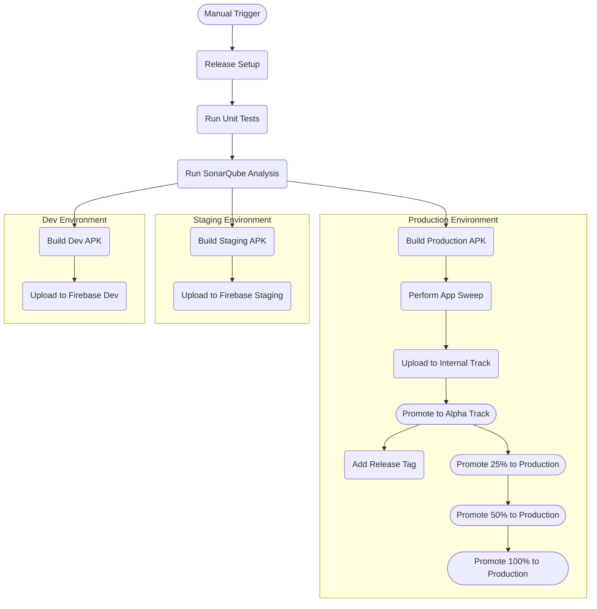

```mermaid
flowchart TD
    trigger([Manual Trigger]) --> setup(Release Setup)
    setup --> unit_tests(Run Unit Tests)
    unit_tests --> sonarqube(Run SonarQube Analysis)
    sonarqube --> deploy_dev(Build Dev APK)
    sonarqube --> deploy_stag(Build Staging APK)
    sonarqube --> deploy_prod(Build Production APK)

    subgraph Production Environment
        deploy_prod --> run_app_sweep(Perform App Sweep)
        run_app_sweep --> google_play_internal(Upload to Internal Track)
        google_play_internal --> google_play_alpha([Promote to Alpha Track])
        google_play_alpha --> add_release_tag(Add Release Tag)
        google_play_alpha --> google_play_prod_25([Promote 25% to Production])
        google_play_prod_25 --> google_play_prod_50([Promote 50% to Production])
        google_play_prod_50 --> google_play_prod_100([Promote 100% to Production])
    end

    subgraph Staging Environment
        deploy_stag --> deploy_firebase_stag(Upload to Firebase Staging)
    end

    subgraph Dev Environment
        deploy_dev --> deploy_firebase_dev(Upload to Firebase Dev)
    end
```
