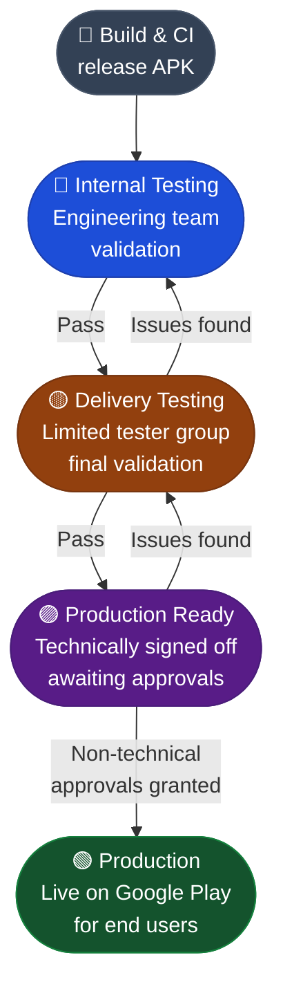

# Simprints ID — Release Dashboard

This branch (`gh-pages`) hosts the **Release Status Dashboard** for the Simprints ID Android app.  
It is served as a GitHub Pages site at:

> **`https://simprints.github.io/Android-Simprints-ID/`**

---

## Purpose

The dashboard gives the team and stakeholders a single, always-up-to-date view of:

- Which **SID version** is live in each deployment environment (Production, Production Ready, Delivery Testing, Internal Testing / Development).
- Direct **APK download** links and **Release Notes** links for each environment.
- A full **All Releases** table listing every GitHub Release tag, title, and APK asset.
- A per-**project** tab showing which SID version each project (e.g. GG2, eCHIS) targets, with its own APK and release notes links.

---

## Files

| File | Description |
|------|-------------|
| `index.html` | The dashboard UI — a single self-contained HTML/CSS/JS page. No build step; it is served directly by GitHub Pages. |
| `status.json` | Machine-written state file that records the current version (and optional APK/release URLs) for each environment. Updated by CI. |
| `projects.csv` | Manually maintained registry of projects and the SID version they are pinned to. |

---

## How `status.json` is updated

`status.json` is updated automatically by CI using the reusable workflow
[`.github/workflows/reusable-update-dashboard.yml`](.github/workflows/reusable-update-dashboard.yml).

The workflow:
1. Checks out this `gh-pages` branch.
2. Uses `jq` to patch the relevant environment key inside `status.json` with the new `version`, `updated_at` timestamp, `apk_url`, and `release_url`.
3. Commits and pushes the change back to `gh-pages`.

### Inputs

| Input | Required | Description |
|-------|----------|-------------|
| `environment` | ✅ | One of `internal_testing`, `delivery_testing`, `production_ready`, `production` |
| `version` | ✅ | Version name, e.g. `2026.2.0` (without the leading `v`) |
| `apk_url` | ➖ | Direct APK download URL |
| `release_url` | ➖ | GitHub Release page URL |

### Callers

| Trigger | Workflow | Description |
|---------|----------|-------------|
| Manual (`workflow_dispatch`) | [`update-release-stage.yml`](.github/workflows/update-release-stage.yml) | Used to promote a version to `delivery_testing` or `production`. Automatically looks up the APK URL from the GitHub Release assets before calling the reusable workflow. |
| Other CI jobs | `reusable-update-dashboard.yml` via `workflow_call` | Other pipelines (e.g. a release build) can call the reusable workflow directly to update `internal_testing` or `production_ready`. |

---

## How `projects.csv` is maintained

`projects.csv` is a **manually edited** CSV file with the following columns:

```
name,sid_version
GG2,v2026.2.0
eCHIS,v2025.1.0
operation_sight,v2024.3.2
```

- **`name`** — Display name shown as a tab on the dashboard.
- **`sid_version`** — The SID release tag that this project is currently targeting (must match a GitHub Release tag exactly, e.g. `v2026.2.0`).

To add a new project or update a version pin, edit this file and push to `gh-pages`.

---

## How `index.html` works

The page is entirely client-side. On load it:

1. **Fetches `status.json`** (cache-busted) to populate the four environment cards at the top.
2. **Fetches all GitHub Releases** from the GitHub API (`/repos/Simprints/Android-Simprints-ID/releases`) — paginated — to build the *All Releases* table and to resolve APK/release URLs for any environment that doesn't have them pre-filled in `status.json`.
3. **Fetches `projects.csv`** (cache-busted) to dynamically inject a tab per project. Each tab displays the project's targeted SID version and links to the corresponding GitHub Release and APK asset.

A `?project=<name>` query parameter can be used to pre-select a specific project tab and hide the main SID Releases tab (useful for deep-linking to a specific project's view).

---

## Updating the dashboard manually

### Promote a version to Delivery Testing or Production

1. Go to **Actions → Promote Release Stage** in the GitHub repository.
2. Click **Run workflow**.
3. Select the target stage (`delivery_testing` or `production`) and enter the version number (e.g. `2026.2.0`).
4. The workflow resolves the APK URL from the GitHub Release and updates `status.json` automatically.

### Update a project's SID version pin

Edit `projects.csv` on the `gh-pages` branch directly (via the GitHub UI or a local checkout) and push.

---

## Release Pipeline



> **How to promote a release:** run the [Promote Release Stage](.github/workflows/update-release-stage.yml) workflow from GitHub Actions, pick the target stage, and enter the version number. The dashboard updates automatically.

---

## Environments explained

| Environment | Colour | Meaning |
|-------------|--------|---------|
| **Production** | 🟢 Green | Live version shipped to end users via Google Play. |
| **Production Ready** | 🟣 Purple | Technically signed off, but held pending non-technical approvals (e.g. user training, project milestones). |
| **Delivery Testing** | 🟡 Amber | Deployed to a limited tester group for final validation before promotion to Production. |
| **Internal Testing** | 🔵 Blue | Active development build used by the engineering team. Not yet ready for wider testing. |
