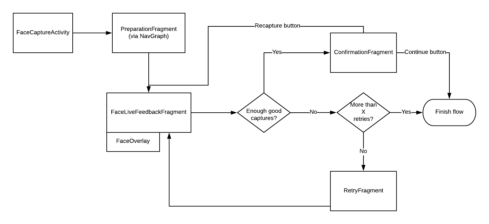

# Capture Flow

The process to call the face module is described elsewhere. This is how the face module works internally to capture the faces, extract the templates, and return the results to SimprintsID.

The current flow looks like this:

>**Should we have a CaptureFragment instead of code in the activity?**
>
> The point made by Tris to have a CaptureFragment was to have less code copied from one CaptureActivity (e.g. Face) to another CaptureActivity (e.g. Palm). However, the code shared by these 2 instances is the same by design. It wouldn’t be the same if the Palm module was not made in the same way as Face, in a similar way that Fingerprint does not share any code with Face.
>
> Since we are not worried about having duplicate code between Face and Palm for this immediate future, the LiveFeedbackFragment will share code between both. Trying to generalize the code before it’s used in the wild is unnecessary effort. (March/2020)

##  FaceCaptureActivity

The activity (and its ViewModel) is responsible for:
- Checking that the correct parameters were sent from SimprintsID for a correct capture (number of samples to capture, sessionId, projectId)
- Start the Navigation Graph
- Managing the next steps of the navigation by using events and the Navigation Graph
- Saving the captures on disk once the flow is finished correctly
- Finish the flow correctly and return the correct result to SimprintsID

## When the flow finishes correctly

The FaceCaptureViewModel receives all captures and saves the valid ones on disk.

## PreparationFragment

It is a simple fragment where the user sees a preparation on how to capture a good face image. Its only responsibility is to show the message and start the LiveFeedbackFragment.

## LiveFeedbackFragment

The responsibility of this fragment (and its ViewModel) is to make sure the user receives correct information on the state of the face on the screen, i.e. if the face is valid or not and how to fix it. This fragment is also responsible to start the camera and handle the frames being passed downstream from our camera library.

The FaceCaptureViewModel has a channel that starts receiving frames when the camera starts. The LiveFeedbackFragment subscribe to that channel and process each frame.

If the face is valid, the fragment will prompt the user to start a capture and at that time will start saving each new frame as a capture. After the number of required captures is done, the fragment finishes and goes either to a ConfirmationFragment or RetryFragment.

During the live feedback process, while the user is trying to center the face on the frame, the ViewModel will keep any good image as a fallback image. This is to make sure that the user always has at least one good image, even if they move the phone too fast during the capture process. This should render the RetryFragment unreachable.

## RetryFragment

If the user can retry the flow, they will come to a fragment that tells a bit more about the problem and how to solve it. Usually the same steps they should take to take a good capture. After that, they return to LiveFeedbackFragment to try again.

After several tries, if the user still can’t take a good photo, the fragment will show some error message and return to SimprintsID an exit error.

## ConfirmationFragment

If all goes well, the user comes to a screen that congratulates them on taking a good photo and ask them to continue their flow.
