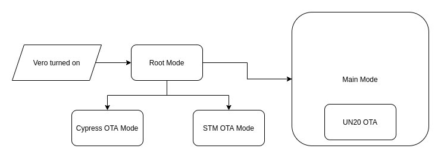

# Fingerprint Scanner V2

## Overview

This package provides an interface for the Vero 2 fingerprint scanner, enabling communication over Bluetooth. The main class, [`Scanner`](scanner/Scanner.kt), serves as the primary entry point for accessing all supported functionalities of the Vero 2.

Although written in Kotlin for Android, the package is platform-agnostic, as it has no Android-specific dependencies. It requires only `java.io.InputStream` and `java.io.OutputStream`, which are provided after establishing a Bluetooth socket connection.

---

## Features

- **Platform Independence**: Designed for portability with no Android dependencies.
- **Stateful Scanner Management**: Ensures commands are executed in the correct state or mode.
- **Error Handling**: Comprehensive exception management and configurable timeouts.
- **Mode Switching**: Supports multiple operational modes, including OTA updates.
- **Coroutines-Based Design**: Fully utilizes Kotlin Coroutines for asynchronous operations.

---

## Getting Started

### Requirements

- Kotlin development environment.
- A Bluetooth-enabled device capable of providing `InputStream` and `OutputStream` for communication.

### Setup

1. Establish a Bluetooth connection using the Android OS or other platform-specific APIs.
2. Pass the `InputStream` and `OutputStream` from the Bluetooth socket to `scanner.connect(inputStream, outputStream)`.

### Teardown

- Call `scanner.disconnect()` to stop IO operations.
- Note: `disconnect()` does not close the `InputStream` or `OutputStream`. Ensure these streams are handled separately.

---

## Scanner Modes

Vero 2 operates in four distinct modes:

1. **Root Mode**: Default mode for initial communication and mode switching.
2. **Main Mode**: Primary mode for performing operations such as fingerprint scans and LED control.
3. **Cypress OTA Mode**: Used for updating Cypress firmware.
4. **STM OTA Mode**: Used for updating STM firmware.

> **Note**: UN20 firmware updates occur in Main Mode.


---

## Communication Details

### Messages

Communication involves three types of messages:

- **Command**: Client-to-scanner requests (e.g., capture fingerprint).
- **Response**: Scanner-to-client replies for commands.
- **Event**: Unsolicited scanner-to-client notifications (e.g., button press).

### Routes

Main Mode communication occurs over three routes:

1. **Vero Server**: Exchanges commands and responses with the STM chip.
2. **Vero Events**: Receives spontaneous events from the STM chip.
3. **UN20 Server**: Communicates with the UN20 chip (requires activation).

### Packets

Main Mode messages are divided into canonical packets to handle the Bluetooth packet size limit (~1000B). These packets include:

- Source and destination
- Packet length
- Message payload (may span multiple packets)

The [`Packet Router`](incoming/main/packet/PacketRouter.kt) handles packet assembly and message reconstruction.

---

## Exception Handling

### Common Exceptions

- **`IOException`**: Stream errors or timeouts.
- **`IllegalStateException`**: Invalid scanner state or mode.
- **`IllegalArgumentException`**: Malformed or invalid messages.
- **`OtaFailedException`**: Specific to OTA failures.

### Coroutines Considerations

To handle errors in coroutine-based operations, use structured exception handling:

```kotlin
try {
    scanner.performOperation()
} catch (e: IOException) {
    // Handle IO errors
} catch (e: IllegalStateException) {
    // Handle invalid state errors
}
```

---

## Chips Overview

Vero 2 comprises three chips:

1. **Cypress Bluetooth Module**: Manages Bluetooth communication.
2. **STM Module**: Controls peripherals, charging, and battery monitoring.
3. **UN20 Module**: Performs fingerprint scanning and LED control. Can be toggled for power savings.

---

## Best Practices

- **State Validation**: Ensure the scanner is in the correct mode before executing commands.
- **Version Check**: Verify firmware compatibility after connecting.
- **Error Handling**: Use structured exception handling to manage timeouts effectively.

---

## Additional Resources

- [Scanner Class](scanner/Scanner.kt): Main entry point for using this package.
- [Error Handling Strategy](scanner/errorhandler/ResponseErrorHandlingStrategy.kt): Configurable error handling.
- [Domain Package](./domain): Contains mode-specific APIs and definitions.

---

This README provides a detailed overview of the Fingerprint Scanner V2 package. For further details, explore the source code and accompanying documentation.

