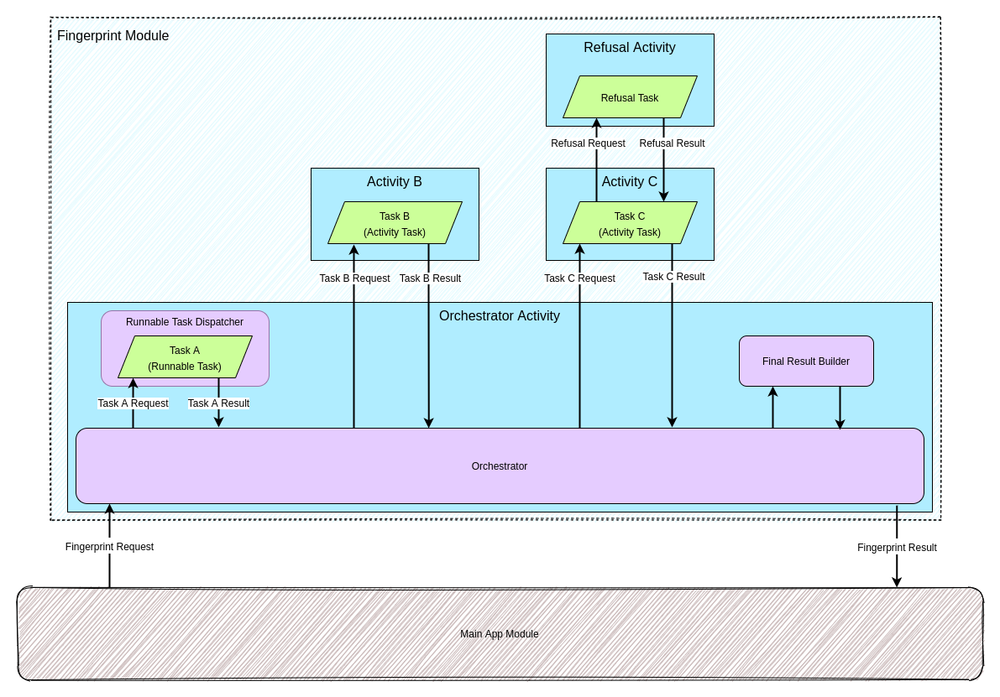

# Fingerprint Orchestrator

This module handles the coordination of Activities based on what was
requested of the `fingerprint` module and returns an appropriate result.
The main class is the [`Orchestrator`](./Orchestrator.kt), which depends
heavily on a [`FingerprintTaskFlow`](./taskflow/FingerprintTaskFlow.kt).

### Orchestrator Activity

An `Orchestrator` object is created when the
[`OrchestratorActivity`](../activities/orchestrator/OrchestratorActivity.kt)
is created. This acts as the entry point of the `fingerprint` module.
The `OrchestratorViewModel` asks for the next Activity to call for, as
well as receives results from the dispatched activities and propagates
the final result.

## Tasks and Task Flow

A [`FingerprintTask`](./task/FingerprintTask.kt) is a granular action
that the `fingerprint` module can perform. These come in two types:

- `RunnableTask` - This refers to a task that does not involve an
  activity but some work that needs to be done. These run in the context
  of the `OrchestratorActivity`.
- `ActivityTask` - This is a task that launches a separate Activity with
  its own UI. This Activity is intended to be self-contained.

All tasks have a [`TaskRequest`](./task/TaskRequest.kt) and
[`TaskResult`](./task/TaskResult.kt). For `ActivityTask`s these must be
parcelable object as they will be sent in the intent and returned by the
Activity. They act like the "arguments" and "return values" of the task.

A [`TaskFlow`](./taskflow/FingerprintTaskFlow.kt) represents a set of
subsequent tasks as part of a single flow. Each task flow corresponds to
a particular
[`FingerprintRequest`](../data/domain/moduleapi/fingerprint/requests/FingerprintRequest.kt).
Later tasks within the task flow may use the `TaskResult` of previous
tasks in their `TaskRequest`.

`RunnableTask`s run within the `OrchestratorActivity` and are executed
via the
[`RunnableTaskDispatcher`](./runnable/RunnableTaskDispatcher.kt).

`ActivityTask`s run within their own Activity and finish with a
[`ResultCode`](./domain/ResultCode.kt):

- If an `ActivityTask` finishes normally the result intent will include
  a `ResultCode.OK` (equivalent to `Activity.OK` in Android). This
  indicates that the normal `TaskResult` will be present and the flow
  will proceed as normal.
- If the user backs out of the Activity or it is interrupted it will
  return a `ResultCode.CANCELLED` (equivalent to `Activity.CANCELLED` in
  Android). This indicates that there is no `TaskResult` present at all
  and the flow is interrupted.
- If the user encountered a terminal exception or error that could not
  be recovered then a `ResultCode.ALERT` will be returned, indicating
  that an `AlertTaskResult` will be returned instead of the normal
  task's result. This will result in the flow being interrupted.
- If the user fills out the refusal form (sometimes called exit form) in
  any Activity, this will result in a `ResultCode.REFUSED` and a
  `RefusalTaskResult` will replace the excepted task result. This will
  result in the flow being interrupted.

At the end of the task flow the
[`FinalResultBuilder`](./../data/domain/moduleapi/fingerprint/FinalResultBuilder.kt)
is called to build a [`FinalResult`](./models/FinalResult.kt) based on
what is required by the original `FingerprintRequest`. If the flow was
interrupted then an appropriate `FinalResult` will be built based on the
reason of the interruption.

The following diagram depicts a task flow with three tasks:

1. Task A, a `RunnableTask`
2. Task B, an `ActivityTask`
3. Task C, an `ActivityTask` where the user invokes the refusal form but
   continues with the flow. This example is used to demonstrate the
   state of the Activity stack at this point.

## Orchestrator State

Due to the `OrchestratorActivity` spending most of its lifecycle on the
back-stack, it can be killed by Android if the system is running low on
resources. This will cause issues as a fresh `Orchestrator` will not
remember which task it is currently on and will always start from the
beginning.

To avoid this, the [`OrchestratorState`](./state/OrchestratorState.kt)
is saved in the `savedInstanceState` of the `OrchestratorActivity` and
restored via `orchestrator.restoreState()` when the activity resumes,
allowing the task flow to pick up where it left off.
