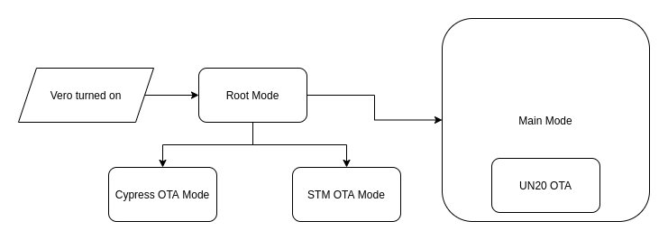
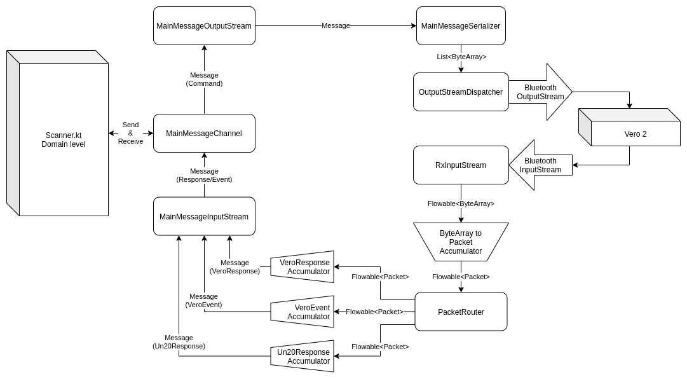

# Fingerprint Scanner V2

### Summary
This package contains the code to interface with a Vero 2 fingerprint
scanner over Bluetooth. The main class is [Scanner](scanner/Scanner.kt)
which allows access to all the functionality supported by Vero 2.

### Platform
It is written in Kotlin with heavy reliance on RxJava. Although it is
written for Android, there are no Android dependencies throughout this
package in anticipation for porting to another platform. It relies on
being handed a `java.io.InputStream` and `java.io.OutputStream` after
the Bluetooth socket is connected.

## Using This Package
The [`Scanner`](scanner/Scanner.kt) class is the single point of use of
this package. The only other classes that should appear as imports
outside of this package are some of the model classes which are taken as
arguments and returned by the methods on Scanner.kt, as well as any
custom exceptions.

### Scanner Setup and Teardown
Use the [`createScanner()`](scanner/CreateScanner.kt) helper function to
build and instance of the `Scanner` class. No work is done on class
instantiation so this class can be created at any time.

To connect the scanner, an `InputStream` and an `OutputStream` are
required. These refer to the streams that become available when
connecting a Bluetooth socket through the Android OS, which should be
performed via the [Component abstractions](../component/bluetooth) for
ease in mocking.

These are then passed into `scanner.connect(inputStream, outputStream)`
to commence the machinery that controls these streams. After `connect`
is called, IO threads will be running that handle stream reading,
transforming, and buffering.

Calling `scanner.disconnect()` causes all RxJava streams to be disposed
and consequently for the threads to be released. The `disconnect` method
does not disconnect the `InputStream` or `OutputStream` themselves, so
disconnecting those will happen separately. The same scanner instance
can be reconnected either with the same streams if they have not been
disconnected, or fresh steams from a new `BluetoothSocket`.

Note that when the scanner is first connected it is in Root Mode. The
recommended flow after first connecting is to check the master version
information to determine what functionality is available, as it is
possible to call methods that would not be compatible with older
versions of the firmware. Methods in `Scanner` or marked if they were
introduced after API version 1.0. After the version number has been
established, then Main Mode can be entered or OTA can be conducted as
necessary.

### Using The Scanner

The scanner maintains its own `ScannerState`, which is updated
appropriately as methods are called and as responses are received from
the Vero. Calling methods on `Scanner` will initially begin with
validating whether we are in the appropriate `state`, such as whether we
are in the appropriate mode or whether the UN20 is on.

If the scanner receives an invalid command it simply will not respond at
all. The purpose of the state validation is to ensure that methods
cannot be called out of order and to throw an exception instead of
letting commands time-out.

All commands have an appropriate time-out that will propagate in the
`onError` if a response is not received within a certain amount of time.
This can be configured with supplying an appropriate
[`ResponseErrorHandlingStrategy`](scanner/errorhandler/ResponseErrorHandlingStrategy.kt).

Separate from the methods that send a command and await a response, one
can register an observer that listens for trigger button presses on the
Vero.

### Exceptions
Use of the methods in [Scanner](scanner/Scanner.kt) can throw certain
subclasses of certain stock exceptions in the `onError`:
- `IOException` - in the case of the underlying Bluetooth stream losing
  connection or a time-out when waiting for a response.
- `IllegalStateException` - when methods on `Scanner.kt` are accessed
  while in the incorrect mode or before connecting/disconnecting.
- `IllegalArgumentException` - malformed or invalid packets or messages
  were received from the scanner.

Furthermore, there is a custom exception that can be thrown only whilst
performing OTA, `OtaFailedException`, which is of type
`RuntimeException`.

Most exceptions are wrapped into the above cases but there could of
course be unanticipated situations where different exceptions can occur,
either propagated within the `onError` or thrown when the method is
invoked.

#### Undeliverable Exceptions

Due to the nature of exception handling in RxJava 2.0,
`io.reactivex.exceptions.UndeliverableException` may be thrown and cause
issues. For this reason it is highly recommended to have an application
level error handler set in place:
```
RxJavaPlugins.setErrorHandler {
    if (e is UndeliverableException) {
        ...
    }
}
```
In most situations you simply want to ignore undeliverable exceptions as
they most commonly occur when a stream is disposed and then an
`IOException` is thrown upon the scanner disconnecting.

## Vero 2.0 Communication

This section contains details on what the code in this package does, on
how communication with Vero 2 is achieved, along with giving definitions
of terms used throughout this package.

### Chips
Vero 2.0 has three chips each with its own firmware and function.
- **Cypress Bluetooth Module** - This is the Bluetooth chip that acts as
  the gateway for all communications between the client device. Its
  functionality is limited to establishing a handshake at the beginning
  of communication and subsequently pipelining data to the other chips.
  This chip is always on when the scanner is on.
- **STM Module** - This is an STM32 chip that acts as the main
  controller for the Vero. It handles all the peripherals of the scanner
  (lights, buttons) as well as charging and battery monitoring
  functionality. This chip is always on when the scanner is on. Note
  that sometimes STM-related domain classes and packages are simply
  prefixed `Vero` instead of `Stm`.
- **UN20 Module** - This is the fingerprint sensor that handles the
  actual capture of fingerprints. It also controls an LED which is used
  to illuminate the fingerprint during capture. This chip can be turned
  off and on by the client device, as it consumes a lot more power than
  the other chips.

### Modes
Vero 2.0 has 4 discrete modes, two of which are used during everyday
operation, and the other two are for performing Over The Air (OTA)
updates to the firmware on two of the three chips. Each mode has its own
completely separate API.

- **Root Mode** - When communication is first established with Vero from
  a client device, Vero starts in Root Mode. This mode is designed to
  act similar to a BIOS operating system selection screen, and is used
  only for selecting other modes. When this mode is active,
  communication with the Cypress Module itself is occurring.
- **Main Mode** - In most normal operation, the client device will
  swiftly enter Main Mode after starting in Root Mode. In this mode, all
  the main functionality of the scanner is available, such as
  controlling the LEDs and taking fingerprint scans. In this mode, the
  Cypress module is piping communication packets to either the STM or
  the UN20.
- **Cypress OTA Mode** - This mode is accessible from Root Mode, and is
  used for updating the firmware on the Cypress module.
- **STM OTA Mode** - This mode is accessible from Root Mode, and is used
  for updating the firmware on the STM module.

Note that there is no distinct mode for UN20 OTA - this is because the
UN20 OTA update can be performed in Main Mode after the UN20 is turned
on.



### Messages
High-level communication between a client device and a scanner is best
understood with the concept of **messages**. A message can be one of
three types:

- **Command** - This is a message from the client device to the scanner
  either requesting a physical action for the scanner to take or
  querying specific information from the scanner. An example of a
  command could be to capture a fingerprint scan.
- **Response** - This is a message from the scanner to the client device
  that only occurs as reply to a prior command. **Every command to the
  scanner results in a separate response**. In this way commands and
  responses form a 1-to-1 dialogue, which is always initiated by the
  client-device. An example of a response could be the result indicating
  whether a requested fingerprint scan was successful.
- **Event** - This is a message from the scanner to the client device
  that can occur unprompted, and exists outside of the above dialogue of
  commands and responses. An example of an event could be that the user
  pressed the trigger button on the Vero.

Each mode has its own API and therefore its own distinct set of
messages. In this code base, this can be seen by the subdivision within
the [domain](./domain) package. Note that sometimes STM-related domain
classes and packages are simply prefixed `Vero` instead of `Stm`.

#### Channels
In this code base, commands are sent over a `MessageOutputStream` and
the response is expected from the `MessageInputStream`. Pairs of
corresponsing Message Output and Input streams are called **channels**.
This acts as a convenient type-safe abstraction for message dialogue.

### Main Mode Communication
Main mode is quite complex in that it involves communication over both
the STM and UN20 chips, while the Cypress acts as a pipe to both these
chips. To facilitate this, and to avoid unintentional interleaving of
messages, Main Mode messages are divided bundled divided into packets
over distinct routes.

#### Routes
There are three remote [routes](domain/main/packet/Route.kt) with which
packets are sent and received.

- **Vero Server** - This is a route for exchanging commands and
  responses to the STM chip, similar to a client-server relationship.
- **Vero Events** - This route is only for receiving spontaneous events
  from the STM chip.
- **UN20 Server** - This route is for communicating with the UN20. Note
  that the UN20 must be on for messages sent over this route.

#### Packets
The maximum size of a chunk of data that can be sent over bluetooth (a
*bluetooth packet*) was found to be around 1000B. Some very long
messages exist in Main Mode (such as the `AcquireImageResponse` which
sends over a 100kB+ image), so we cannot rely on sending an entire
message within a single bluetooth packet.

For this reason, Main Mode messages are intentionally divided by both
the client device and the Vero into *canonical packets*. This allows us
to affix a header with routing information, so they can be properly
assembled at the opposite end without interleaving if messages happen to
be sent over multiple routes simultaneously. The structure of a
canonical packet contains the following:
- Source of the packet Destination of the packet
- Length of the packet
- The packet payload

The packet payload will be the message that is to be sent. For short
messages, this will be the entire message. For longer messages, the
message will be chunked across multiple packets. Both in this code base
and on the Cypress module there is a
[Packet Router](incoming/main/packet/PacketRouter.kt), that accumulates
packets as needed, strips the packet header, and assembles the message.

Packets contain the message completely unchanged - this means that the
message will contain its own header as it sits within the payload of a
packet, or multiple packets.

For all modes other than Main Mode, there is no "canonization" of
packets - messages are sent directly in raw bluetooth packets. These
other messages are all much less than the 1000B or so mark so risk of
interleaving or splitting is minimal

### Data Pipeline

#### Input and Output Streams
When a bluetooth socket is connected, an `InputStream` and
`OutputStream` is provided by the OS for communication, which is passed
into the [Scanner](scanner/Scanner.kt) class when connected. These are
for sending raw bytes of information. The [incoming](./incoming) and
[outgoing](./outgoing) packages are for transforming the raw byte stream
into the domain layer `MessageInputStream`s and `MessageOutputStream`s
for use by the [Scanner](scanner/Scanner.kt) class.

#### Incoming
The following is the pipeline for receiving data over Bluetooth to an
observer subscribing to the Main Mode message stream as found in the
[incoming](./incoming) package:
1. The stream is transformed into the RxJava world, so that
   `InputStream` becomes a `Flowable<ByteArray>`, where the `ByteArray`s
   are the bluetooth packets received ove the stream.
2. (If in Main Mode) The `ByteArray`s are accumulated and parsed into
   `Packet`s so the stream is then of type `Flowable<Packet>`.
3. The `Packet` stream is then routed by the `PacketRouter` which 1
   exposes a `Flowable<Packet>` for each route
4. The `MessageInputStream` accumulates packets from the observed route,
   and parses them into a `Message` using a `MessageParser`

Note that for the modes other than Main Mode, there is no packeting and
routing steps - the `Flowable<ByteArray>` from the `InputStream` is
directly accumulated and parsed as messages.

#### Outgoing
The [outgoing](./outgoing) package contains the pipeline for
transmitting data over Bluetooth, with the following steps for the Main
Mode message stream:
1. The message to be sent is serialized by a `MessageSerializer`, which
   involves chunking the message for large messages
2. The message chunks are then "canonized" inside a packet, with a
   packet header affixed
3. The packets are then dispatched sequentially by the
   `OutputStreamDispatcher`

Note that for that modes other than Main Mode, there is no canonization
of the packets - the message chunks are sent directly to be dispatched.

#### Full Data Flow Diagram

This diagram illustrates the data pipeline for both outgoing and
incoming data for Main Mode. Note that for other modes, the diagram is
simpler as incoming `ByteArray`s are accumulated and parsed directly
into messages without the routing/packet intermediate step.



### API Specifications
The list of commands available and their corresponding byte
representation can be inferred from the [domain](./domain) package.
Additionally, a complete tabulation can be found on Confluence:
- [Root Mode API Specification](https://simprints.atlassian.net/wiki/spaces/F/pages/800555020/Vero+2.0+Root+Mode+API)
- [Main Mode API Specification](https://simprints.atlassian.net/wiki/spaces/F/pages/746946567/Vero+2.0+Main+Mode+API)
- [Cypress OTA Mode  API Specification](https://cypresssemiconductorco.github.io/btsdk-docs/BT-SDK/WICED-Firmware-Upgrade-Library.pdf)
  (pages 7-9)
- [STM OTA API Specification](https://www.st.com/content/ccc/resource/technical/document/application_note/51/5f/03/1e/bd/9b/45/be/CD00264342.pdf/files/CD00264342.pdf/jcr:content/translations/en.CD00264342.pdf)
