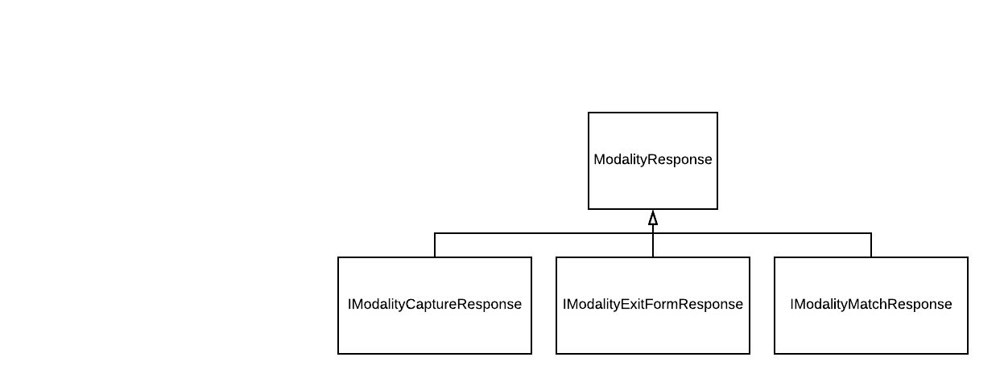
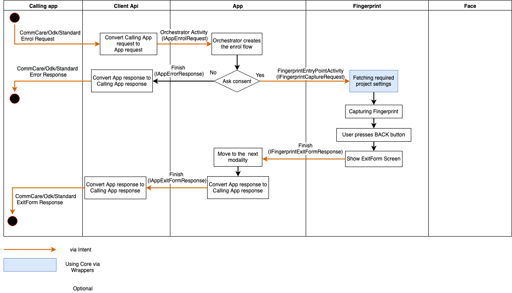

# Exit Form flow for SimprintsID

When the user is using the app, sometimes something can happen and the user might want to exit the app. For those cases, SimprintsID uses a concept of an Exit Form, a form that asks the user some questions to understand why they tried to finish the flow early (i.e. without completing it).

SimprintsID can show the Exit Form for the users in different places.

- If the user declines consent. That exit form will show an exit form based on the first modality that should appear for the user (right now, fingerprint or face). The classes that handle those cases are [FaceExitFormActivity.kt](../src/main/java/com/simprints/id/activities/faceexitform/FaceExitFormActivity.kt) and [FingerprintExitFormActivity.kt](../src/main/java/com/simprints/id/activities/fingerprintexitform/FingerprintExitFormActivity.kt).

- If the user presses back during biometric capture. Each modality handles the user pressing the back button inside their own module.
  - For fingerprint the class that handles it is [RefusalActivity.kt](../../fingerprint/src/main/java/com/simprints/fingerprint/activities/refusal/RefusalActivity.kt)
  - For face the class that handles it is [ExitFormFragment.kt](../../face/src/main/java/com/simprints/face/exitform/ExitFormFragment.kt)

Since each modality can have different options, the exit forms are copied to each modality instead of having one that sits in `id` and tries to handle all the options. We are aware of the cost of maintaining different versions of the exit forms but that gives us more freedom to implement in our own way inside each modality (activity vs fragment, for example).

# SimprintsID to modality request and response

When SimprintsID calls the modality, it calls it with an `Intent` based on a `moduleapi` interface for the current job for that modality, like [IFaceCaptureRequest.kt](../../moduleapi/src/main/java/com/simprints/moduleapi/face/requests/IFaceCaptureRequest.kt). More about it can be read in the [Modularisation document](https://docs.google.com/document/d/1E-SNLGbqsAjn1IVamQhDEcWQJ092tLnNLLeTCo_A160/edit#). Each Request has its own Response, that can be seen in `moduleapi`. So, for example a `IFaceRequest` have an associated [IFaceResponse.kt](../../moduleapi/src/main/java/com/simprints/moduleapi/face/responses/IFaceResponse.kt).

Considering that the user can exit the app by using the Exit Form (previously known as Refusal Form), SimprintsID needs to be able to recognize and handle this response as well. What happens is that [IFaceResponse.kt](../../moduleapi/src/main/java/com/simprints/moduleapi/face/responses/IFaceResponse.kt) has a type, that SimprintsID will handle when it gets the response.

The [IFaceExitFormResponse.kt](../../moduleapi/src/main/java/com/simprints/moduleapi/face/responses/IFaceExitFormResponse.kt) has 2 attributes, a reason and an extra. The reason is the mapping from the option that the user selected and the extra is the text typed by the user. The reason need to be mapped to an `IFaceExitReason` because that is the interface that `moduleapi` understands.

When the modality step is finished, SimprintsID Orchestrator (and related classes) will check if the response was successful or if it was a refusal event. If it was a refusal event, all subsequent steps will be marked as completed. You can check this logic in [ModalityFlowBaseImpl.kt](../src/main/java/com/simprints/id/orchestrator/modality/ModalityFlowBaseImpl.kt#L68).

After every step, the Orchestrator checks if there is at least one step waiting to run. In the case of a refusal event, all steps were marked as complete so the Orchestrator will create the response for the calling app. The first step in that is checking if there was any error or refusal event in the flow. If there was one, SimprintsID should return the error or refusal event to the calling app. That is done in [BaseAppResponseBuilder.kt](../src/main/java/com/simprints/id/orchestrator/responsebuilders/BaseAppResponseBuilder.kt#L21).

Again, the Orchestrator maps the Exit Form from each modality to an AppRefusalFormResponse that is a standardized way for the calling app.

# Hawkeye event - Refusal Event

When the modality wants to send an event to Hawkeye it uses the [RefusalEvent.kt](../src/main/java/com/simprints/id/data/db/session/domain/models/events/RefusalEvent.kt). Currently each modality has its own RefusalEvent that is mapped to the one in `id` and that one is sent to Hawkeye. If a new option is needed, it needs to be added to that file and to Hawkeye.

