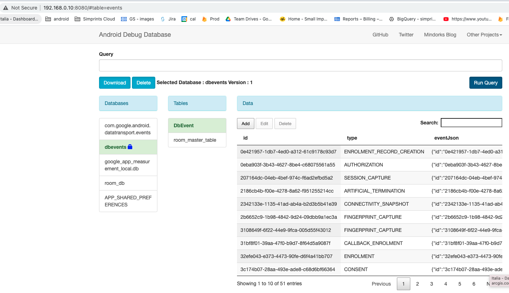

# Troubleshooting Room db with events
The events db is room based and encrypted, so to explore the content of the db you need to created a db with a fixed password:

1) Uninstall SID
2) Set a fixed password in DbEventDatabaseProvider (e.g. `val key = "test".toCharArray()`)
2) Add the password in android.buildTypes.debug `resValue("string", "DB_PASSWORD_DBEVENTS", "test")`
3) Add `debugImplementation 'com.amitshekhar.android:debug-db:1.0.6'` and `debugImplementation 'com.amitshekhar.android:debug-db-encrypt:1.0.6'`
4) Install SID
4) Access the https://phone_ip:8080/

The added library will create a web server showing the room data: 

Note: you can't access a db that was already encrypted with a password that was generated by SID

