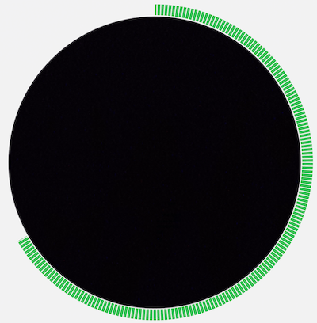

# UI Components module

This module was created to extract common widgets and UI code that can be used by multiple modules.

# Custom widgets

## [DashedCircularProgress](src/main/java/com/simprints/uicomponents/widgets/DashedCircularProgress.kt)

This is a variant of circular progress bar that have spaces between bars (as opposed to a filled progress bar).

